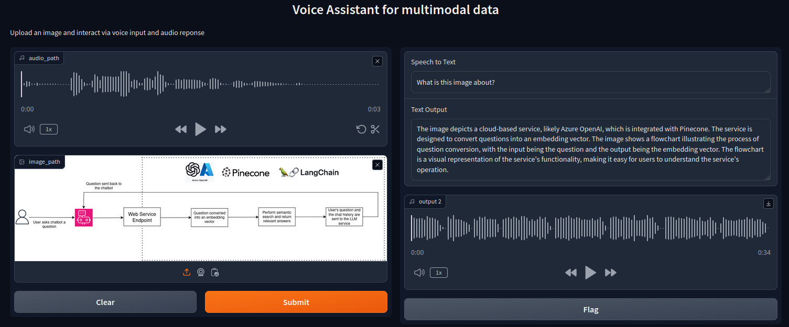

# Voice Assistant 

This voice assistant allows users to interact through a combination of audio and images. You can ask your desired question in the form of audio input and insert an image. The assistant will transform your audio into text, analyze the image, generate a descriptive text response, and then convert that response back into audio. 
All interactions are facilitated through an intuitive Gradio interface.

## Features
- **Audio to Text**: Converts spoken input into text using Whisper, a state-of-the-art model for automatic speech recognition.

- **Image to Text**: Analyzes an image and generates a descriptive text response using the LLaVA model.

- **Text to Audio**: Converts the generated text back into speech, providing an audio response for the user.

- **Gradio Interface**: A user-friendly interface built with Gradio, allowing easy interaction with the voice assistant's functionalities directly from web browser.

## Models Used
### Whisper (Medium)

Whisper is a versatile speech recognition model developed by OpenAI. The medium variant of Whisper balances performance and computational requirements, making it suitable for real-time applications. It is trained on a large dataset of diverse audio to achieve robust and accurate transcriptions, even in noisy environments.

### LLaVA (llava-hf/llava-1.5-7b-hf)

LLaVA (Language and Vision Assistant) is an advanced model designed to process and understand images. The version used here, `llava-hf/llava-1.5-7b-hf`, is a powerful model capable of generating detailed descriptions and explanations of images. It leverages deep learning techniques to analyze visual content and produce natural language descriptions.

## Results
